# Отчет по лабораторной работе **№2**

Дисциплина: Операционные системы

Студент: Чепелев Алексей Николаевич

Группа: НПМбв-02-20

Москва 2024 г.


# Цель работы
•	Изучить идеологию и применение средств контроля версий.
•	Освоить умения по работе с git.

# Выполнение лабораторной работы
Установка git
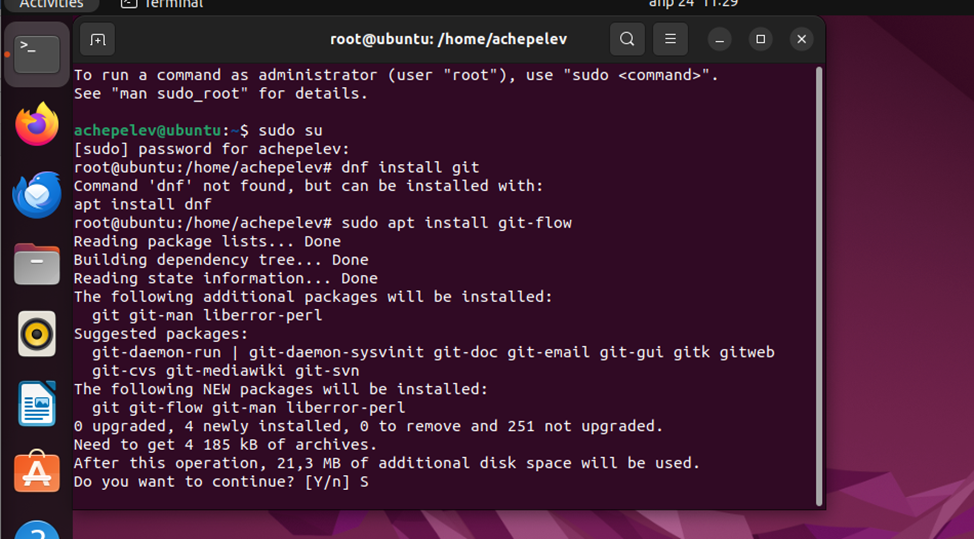

Установка ```gh```
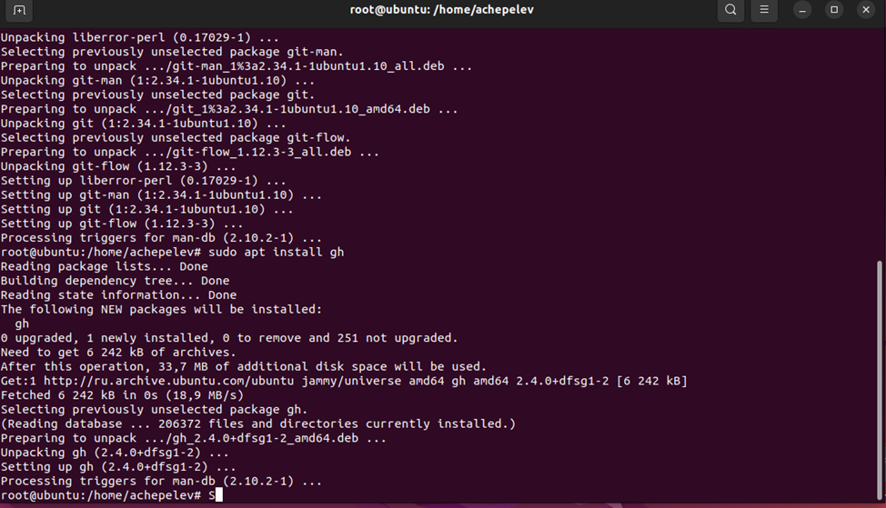

Базовая настройка ```git```
Зададим имя и email владельца репозитория:
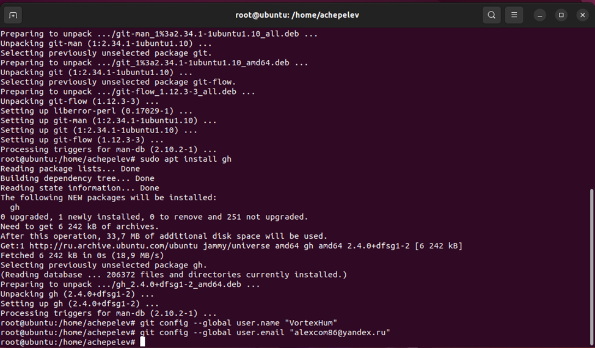

Настроим utf-8 в выводе сообщений ```git```: 
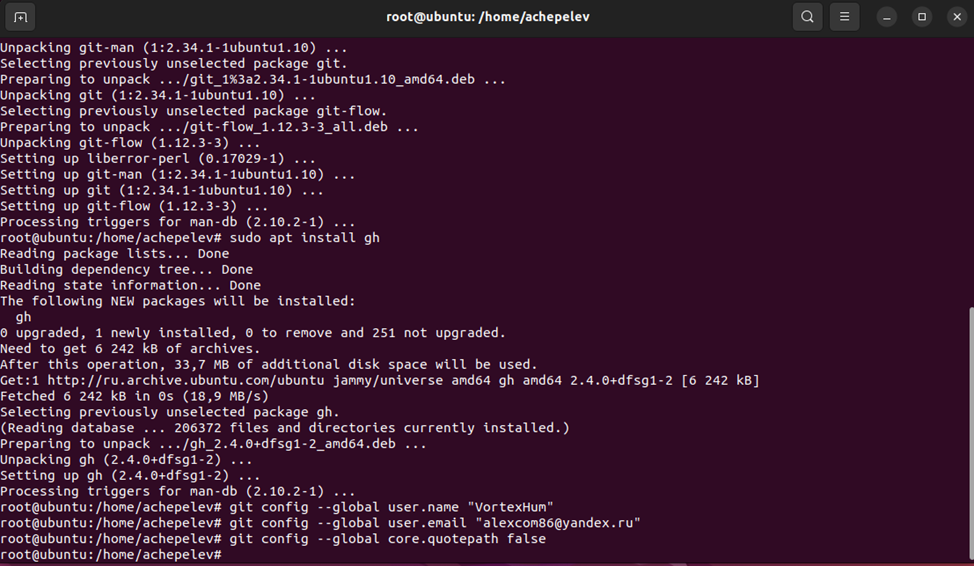

Зададим имя начальной ветки:
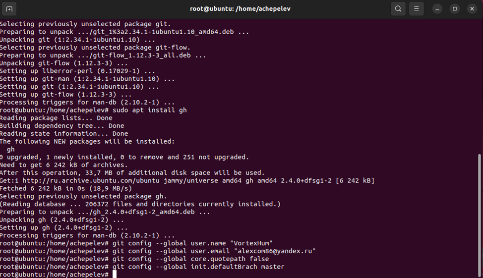

Параметр autocrlf; Параметр safecrlf;
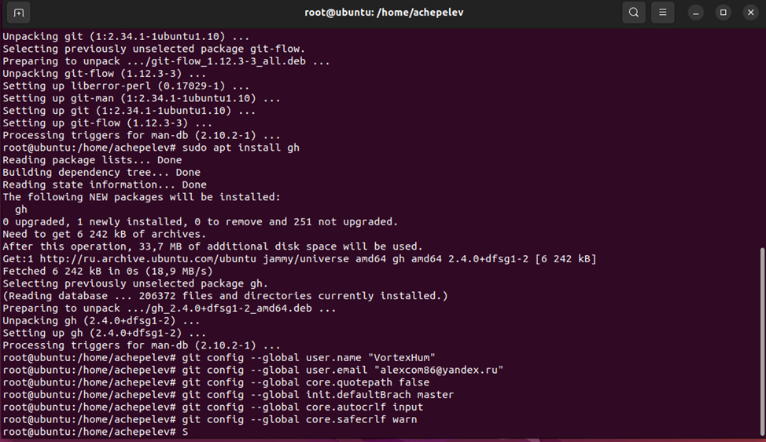

Создание ключа ```ssh```
по алгоритму rsa с ключём размером 4096 бит:
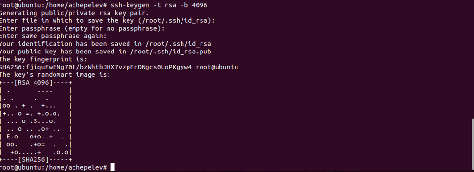

по алгоритму ```ed25519```:
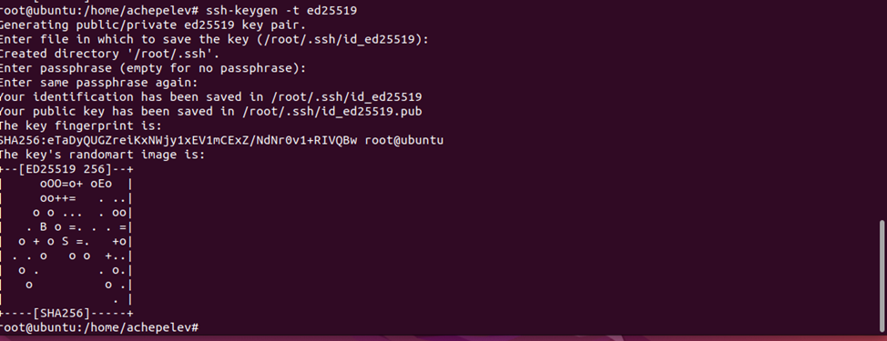

Создание ключа ```gpg```
Генерируем ключ
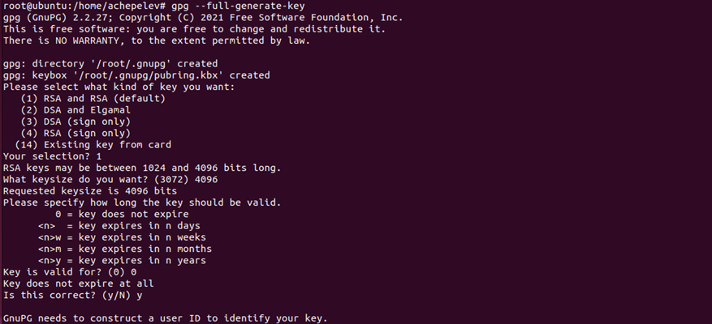
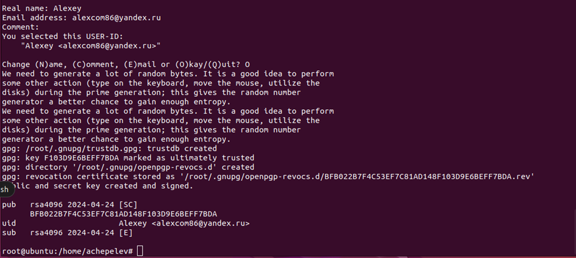

Добавление GPG ключа в GitHub
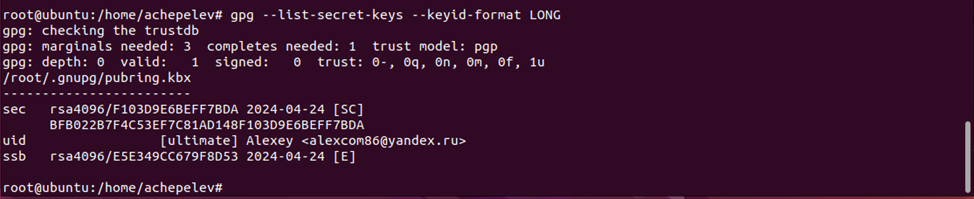

Cкопирую мой сгенерированный GPG ключ в буфер обмена:
 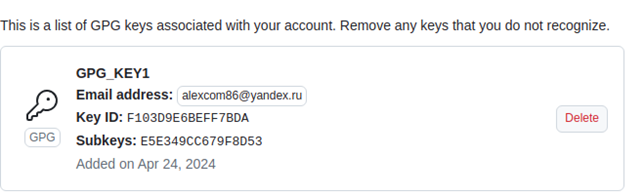

 Настройка автоматических подписей коммитов git
 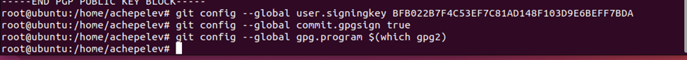

 Настройка ```gh``` (Логин в github)
 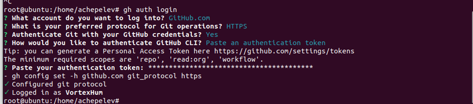

 Создание репозитория курса на основе шаблона
 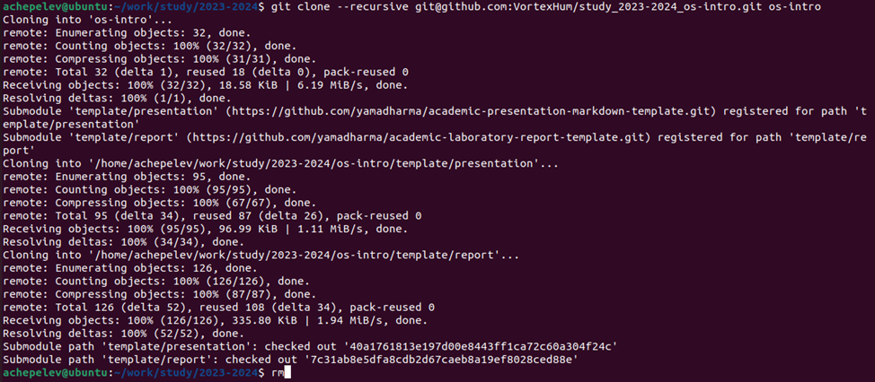
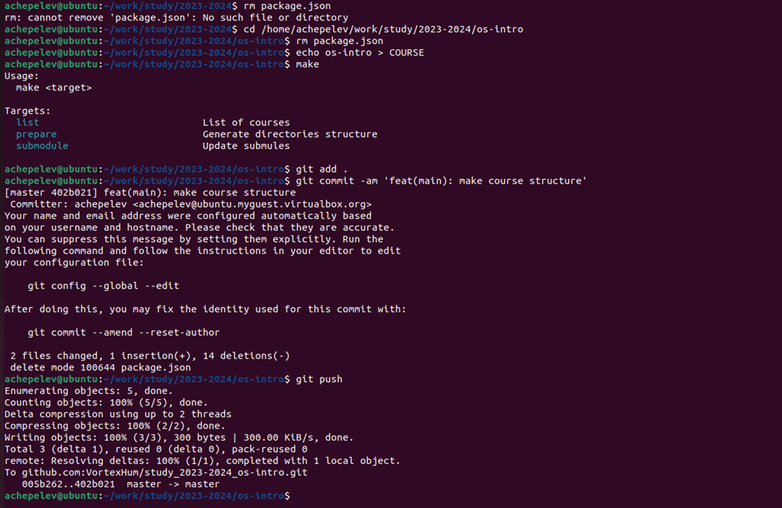

# Контрольные вопросы:

1. Что такое системы контроля версий (VCS) и для решения каких задач они предназначаются?
Система контроля версий (VCS) - это программное обеспечение, которое помогает отслеживать изменения в файлах и коде проекта, управлять различными версиями файлов, контролировать доступ к изменениям, а также облегчает совместную работу разработчиков над проектом.

2. Объясните следующие понятия VCS и их отношения: хранилище, commit, история, рабочая копия.
Хранилище: Хранилище в системе контроля версий (VCS) - это централизованное место, где хранятся все файлы проекта, его история изменений, метаданные и другая информация, управляемая VCS.
Commit: Commit в системе контроля версий (VCS) - это действие, при котором разработчик сохраняет текущие изменения в файле или наборе файлов в репозиторий. При коммите разработчик оставляет комментарий, описывающий сделанные изменения.
История: История в системе контроля версий - это список всех коммитов и изменений, которые были сделаны в проекте. В истории можно отследить, кто и когда внес какие изменения.
Рабочая копия: Рабочая копия в системе контроля версий представляет собой локальную копию файлов проекта на компьютере разработчика. Это набор файлов, с которым мы работаем в настоящий момент. Рабочая копия может быть изменена, но изменения не будут отправлены в репозиторий до коммита.

3. Что представляют собой и чем отличаются централизованные и децентрализованные VCS? Приведите примеры VCS каждого вида.
Централизованные VCS: В централизованных VCS существует единый центральный сервер, на котором хранится вся история проекта и куда отправляются все изменения от разработчиков. (CVS (Concurrent Versions System) и SVN (Subversion))
Децентрализованные VCS: В децентрализованных VCS каждый участник проекта имеет собственную копию репозитория, что позволяет им работать независимо друг от друга, выполнять коммиты локально и синхронизироваться с другими участниками по необходимости.( Git и Mercurial)

4. Опишите действия с VCS при единоличной работе с хранилищем:
Создание нового репозитория > Добавление файлов > Коммит изменений > Просмотр истории изменений

5. Опишите порядок работы с общим хранилищем VCS:
Клонирование репозитория > Добавление и коммит изменений > Получение обновлений > Разрешение конфликтов > Отправка изменений > Code Review

6. Каковы основные задачи, решаемые инструментальным средством git?
Управление версиями; Работа с ветками; Совместная работа; Отслеживание изменений; Работа в оффлайне; Резервное копирование и восстановление; Code Review.

7. Назовите и дайте краткую характеристику командам git:
```git init```: Создает новый репозиторий Git.
```git clone```: Клонирует существующий репозиторий в локальный каталог.
```git add```: Добавляет изменения в рабочем каталоге в индекс (подготовленные изменения).
```git commit```: Фиксирует индексированные изменения в истории репозитория.
```git push```: Отправляет локальные изменения в удаленный репозиторий.
```git pull```: Получает изменения из удаленного репозитория и объединяет их с локальным репозиторием.
```git branch```: Показывает, создает, удаляет или переключает ветки.
```git merge```: Объединяет изменения из одной ветки в другую.
```git checkout```: Переключается между ветками или восстанавливает файлы из индекса.
```git status```: Показывает текущее состояние рабочего каталога и индекса.
```git log```: Показывает историю коммитов.
```git reset```: Позволяет отменять коммиты или сбрасывать изменения.

8. Приведите примеры использования при работе с локальным и удалённым репозиториями.
Работа с локальным репозиторием:
Инициализация репозитория: ```git init```
Добавление файлов в индекс: ```git add file.txt```
Фиксация изменений в коммите: ```git commit -m "Добавлен новый файл file.txt"```
Создание новой ветки: ```git branch new-feature```
Переключение на другую ветку: ```git checkout new-feature```
Работа с удаленным репозиторием:
Клонирование удаленного репозитория: ```git clone https://github.com/username/repository.git```
Отправка изменений в удаленный репозиторий: ```git push origin main```
Получение изменений с удаленного репозитория: ```git pull origin main```
Просмотр удаленных репозиториев: ```git remote -v```
Удаление ветки в удаленном репозитории: ```git push origin --delete branch-name```

9. Что такое и зачем могут быть нужны ветви (branches)?
Изоляция изменений; Параллельная разработка; Стабильность основной ветви; История изменений.

10. Как и зачем можно игнорировать некоторые файлы при commit?
Игнорирование определенных файлов при коммите в Git осуществляется с помощью файла ```.gitignore```. Этот файл содержит шаблоны для файлов или папок, которые мы хотим игнорировать при фиксации изменений в репозитории.


