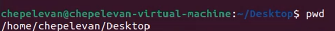
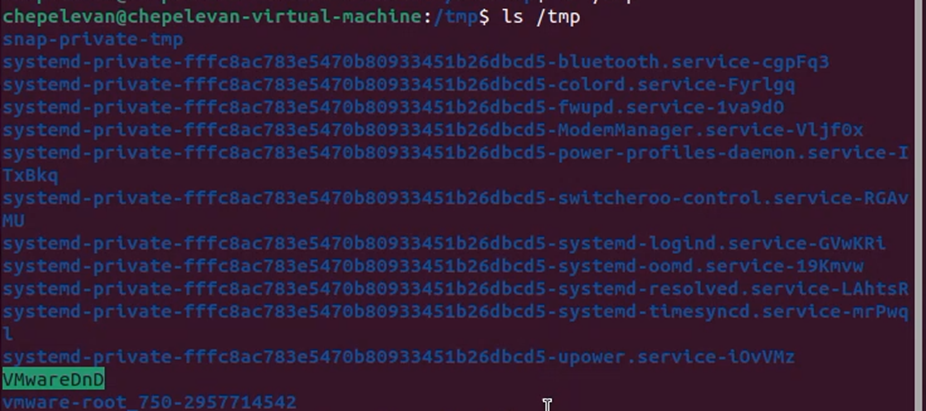
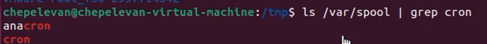
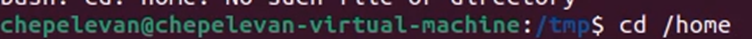
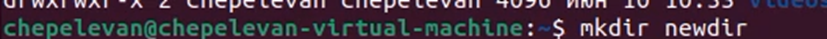
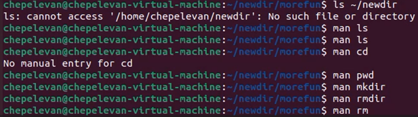
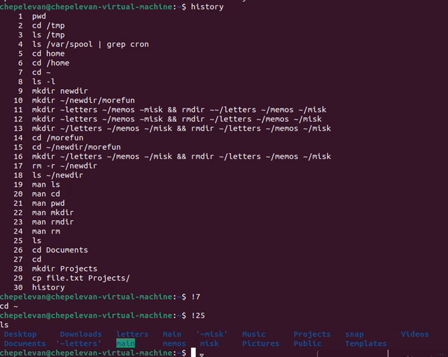

# Отчет по лабораторной работе **№4**

Дисциплина: Операционные системы

Студент: Чепелев Алексей Николаевич

Группа: НПМбв-02-20

Москва 2024 г.


# Цель работы
Приобретение практических навыков взаимодействия пользователя с системой посредством командной строки.

# Выполнение лабораторной работы
1. Определяю полное имя домашнего каталога командой ```pdw```


2. Перехожу в каталог ```/tmp``` командой ```cd /tmp```


3. Вывожу на экран содержимое каталога при помощи команды ```ls /tmp```


4. Определяю, есть ли в каталоге ```/var/spool``` подкаталог с именем ```cron```


5. Перехожу в домашний каталог


6. Создаю новый каталог ```newdir```


7. В домашнем каталоге создаю три новых каталога командой и одновременно удаляю их
```mkdir ~/letters ~/memos ~/misk && rmdir ~/letters ~/memos ~/misk```

8. С помощью команды man```ls``` узнаю, какую опцию нужно использовать для просмотра содержимого каталогов и подгаталогов: ```-R```

9. При помощи команды man нахожу опции следующих команд:
```Cd; pwd; mkdir; rmdir; rm.```


10. Используя информацию, полученную при помощи команды ```history```, выполняю модификацию и исполнение нескольких команд из буфера команд


# Вывод
В этой лабораторной работе я научился взаимодействовать с системой при помощи командной строки.


# Контрольные вопросы:
Ответы на вопросы:
1. Что такое командная строка?
Командная строка - это интерфейс, где пользователь может вводить текстовые команды для управления операционной системой или программами.
2. При помощи какой команды можно определить абсолютный путь текущего каталога?
Pwd
3. При помощи какой команды и каких опций можно определить только тип файлов и их имена в текущем каталоге?
```Ls -i```
4. Каким образом отобразить информацию о скрытых файлах?
```Ls -a```
5. При помощи каких команд можно удалить файл и каталог?
```Rm rmdir```
6. Каким образом можно вывести информацию о последних выполненных пользователем командах? работы? 
```History```
7. Как воспользоваться историей команд для их модифицированного выполнения? Приведите примеры.
```!5  !!  !git```
8. Приведите примеры запуска нескольких команд в одной строке.
```make & sudo apt-get update```
9. Дайте определение и приведите примеры символов экранирования.
Символ экранирования - это специальный символ, который используется для изменения значения других символов. 
```\   cat /path/to/file\ with\ spaces.txt```
10. Охарактеризуйте вывод информации на экран после выполнения команды ```ls``` с опцией ```l```.
Первая колонка: Тип файла и права доступа. Например: ```-rw-r--r--```
Вторая колонка: Количество ссылок на файл/директорию.
Третья колонка: Пользователь, владеющий файлом/директорией.
Четвертая колонка: Группа, к которой относится файл/директория.
Пятая колонка: Размер файла в байтах.
Шестая колонка: Дата и время последней модификации файла.
Седьмая колонка: Имя файла или директории.

11. Что такое относительный путь к файлу?
Относительный путь к файлу — это путь к файлу или директории, который указывает на их расположение относительно текущего рабочего каталога в файловой системе.
12.  Как получить информацию об интересующей вас команде?
```Man команда```
```Man ls```
13.  Какая клавиша или комбинация клавиш служит для автоматического дополнения вводимых команд?
Клавиша ```tab```
