# Отчет по лабораторной работе **№5**

Дисциплина: Операционные системы

Студент: Чепелев Алексей Николаевич

Группа: НПМбв-02-20

Москва 2024 г.

# Цель работы
Приобретение практических навыков взаимодействия пользователя с системой посредством командной строки.

# Выполнение лабораторной работы
1. Выполняю все примеры, приведённые в первой части описания лабораторной работы
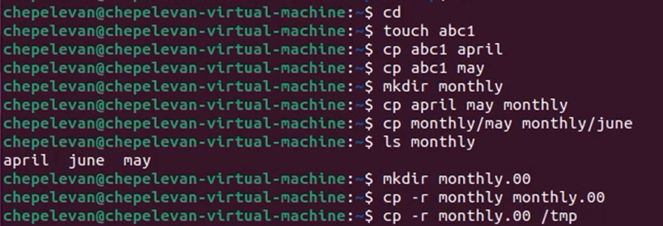

2. В домашнем каталоге создаю директорию ```~/ski.plases```
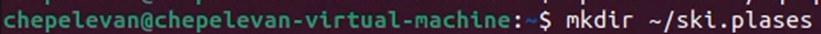

3. Перемещаю файл ```equipment``` в каталог ```~/ski.plases```


4. Переименовываю файл ```~/ski.plases/equipment``` в ```~/ski.plases/equiplist```
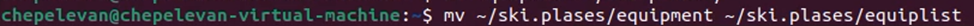

5. Создаю в домашнем каталоге файл ```abc1``` и скопирую его в каталог ```~/ski.plases```
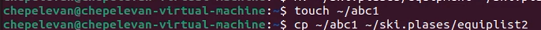

6. Создаю каталог с именем ```equipment``` в каталоге ```~/ski.plases```
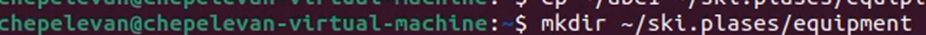

7. Перемещаю файл ```~/ski.plases/equiplist``` в каталог ```~/ski.plases/equipment```
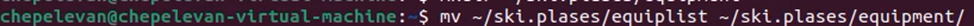

8. Создаю и перемещаю каталог ```~/newdir``` в каталог ```~/ski.plases``` и назоваю его ```plans```


9. Определяю опции команды ```chmod```, необходимые для того, чтобы присвоить перечисленным ниже файлам выделенные права доступа
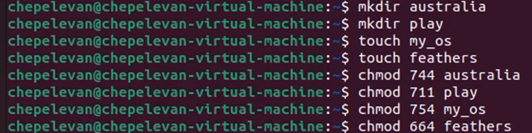

10. Просмотриваю содержимое файла ```/etc/password```

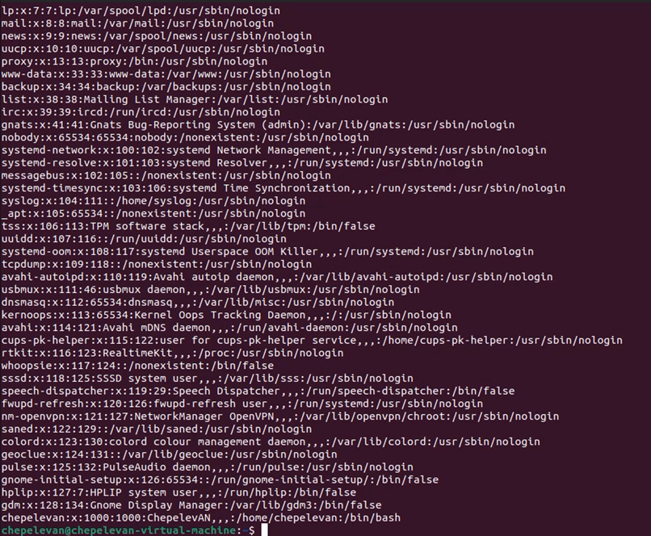

11. Копирую файл ```~/feathers``` в файл ```~/file.old```


12. Перемещаю файл ```~/file.old``` в каталог ```~/play```


13. Копируйте каталог ```~/play``` в каталог ```~/fun```
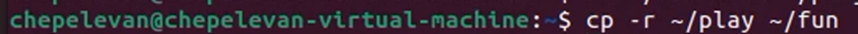

14. Перемещаю каталог ```~/fun``` в каталог ```~/play``` и называю его games
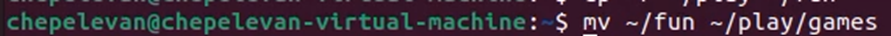

15. Лишаю владельца файла ```~/feathers``` права на чтение


16. Проверка файла ```~/feathers``` командой ```cat```
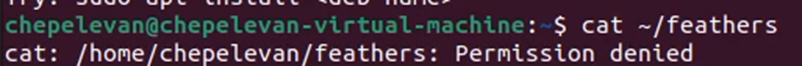

17. Выдаю владельцу файла ```~/feathers``` право на чтение
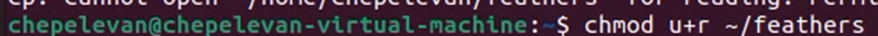

18. Лишаю владельца каталога ```~/play``` права на выполнение


19. Выдаю владельцу каталога ```~/play``` право на выполнение
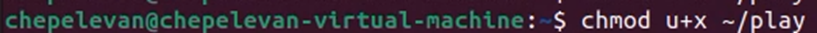

20. Выполняю команду ```man``` для таких команд, как: ```mount```, ```fsck```, ```mkfs```, ```kill```
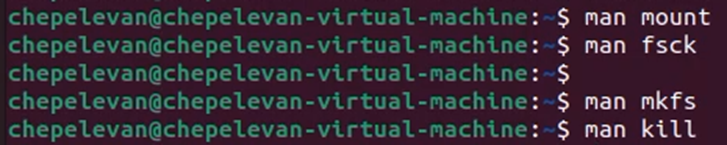

# Вывод
В этой лабораторной работе я ознакомился с файловой системой Linux, её структурой, именами и содержанием каталогов. Приобрёл практические навыки по применению команд для работы с файлами и каталогами.

# Ответы на вопросы:
1. ```ext4``` поддерживает большие объемы файлов и дисков
2. ```/``` – верхний уровень файловой системы; ```/bin``` - cодержит основные исполняемые файлы; ```/etc``` – в ней хранятся конфигурационные файлы системы; ```/home``` - содержит домашние каталоги пользователей; ```/dev``` - здесь находятся специальные файлы, представляющие устройства системы; ```/var``` - содержит переменные данные системы, такие как логи, временные файлы, базы данных и другую переменную информацию.
3. ```sudo mount /dev/sdb1 /mnt/data```
4. Неправильное выключение компьютера; вредоносное ПО; сбои в ПО; недостаточно места на диске.
5. ```sudo mkfs.ext4 /dev/sdb1```
6. ```cat``` - просмотра содержимого текстовых файлов; ```less``` – просмотр текстовых файлов постранично; ```more```  - аналог ```less```; ```head``` – выводит первые несколько строк из текстового файла; ```tail``` – выводит последние несколько строк из текстового файла; ```grep``` – поиск текста в файлах.  
7. Копирование файлов; копирование каталогов; сохранение атрибутов файлов; информационные сообщения.
8. Перемещение файлов; переименование файлов; перемещение каталогов.
9. Права доступа и их изменение:
```r``` - чтение
```w``` - запись
```x``` - выполнение
```chmod u+r(-r) file.txt```

