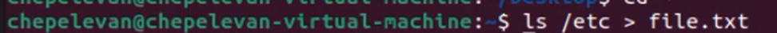
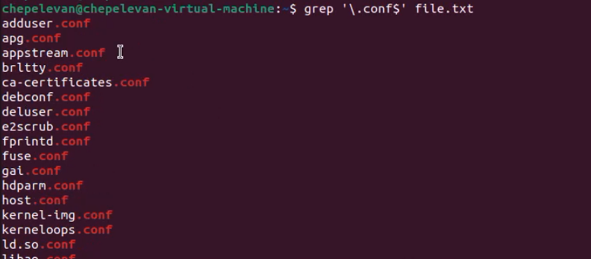
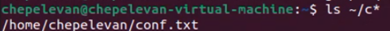
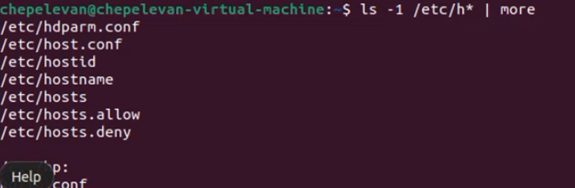
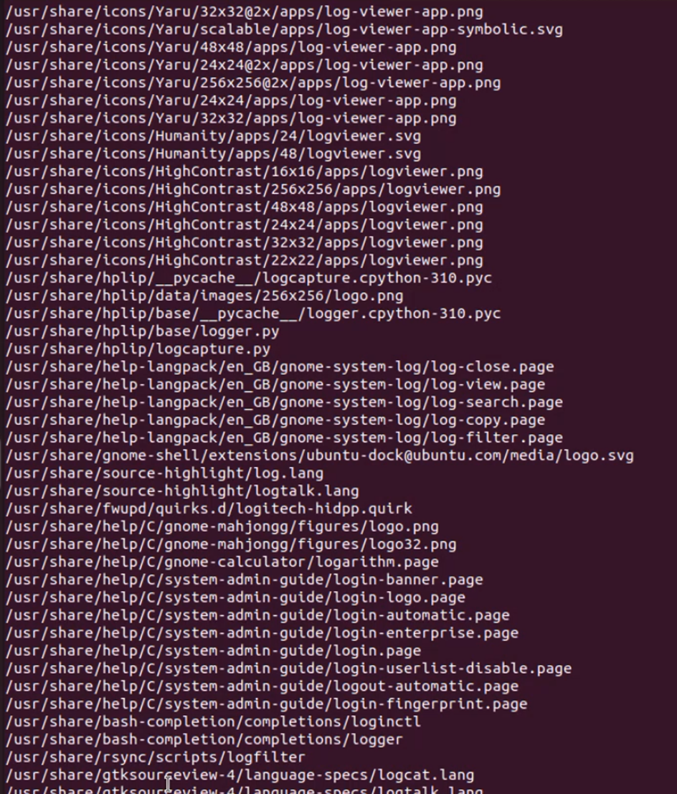
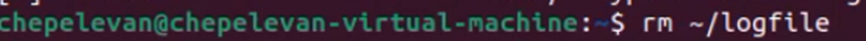
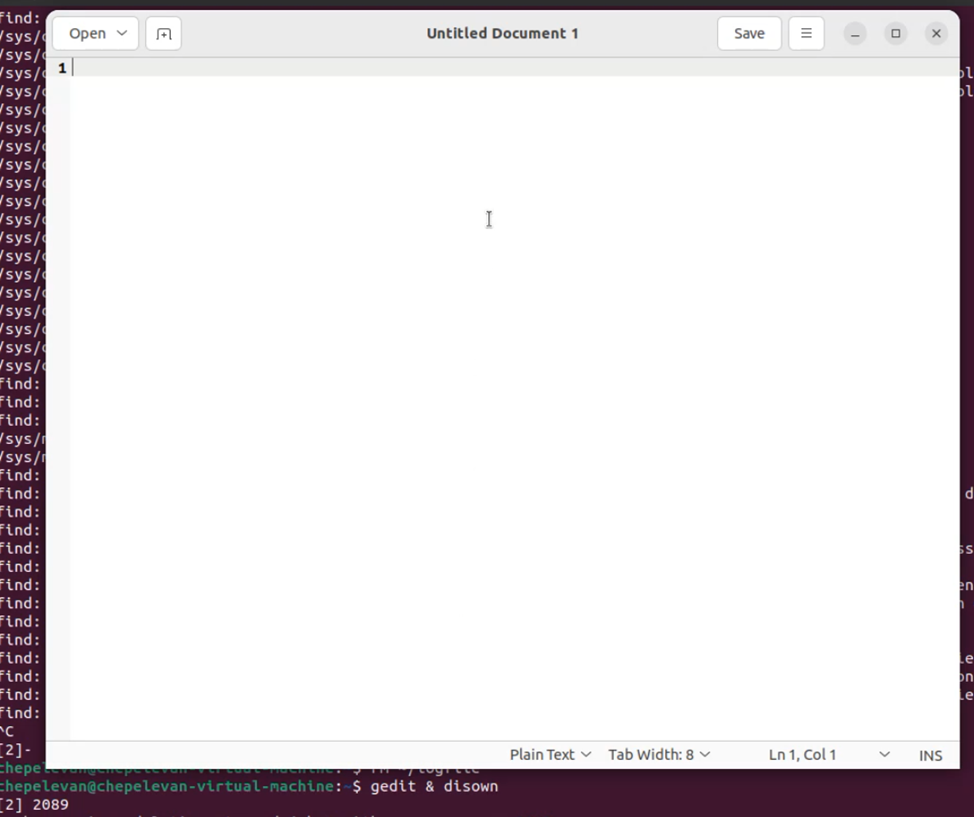
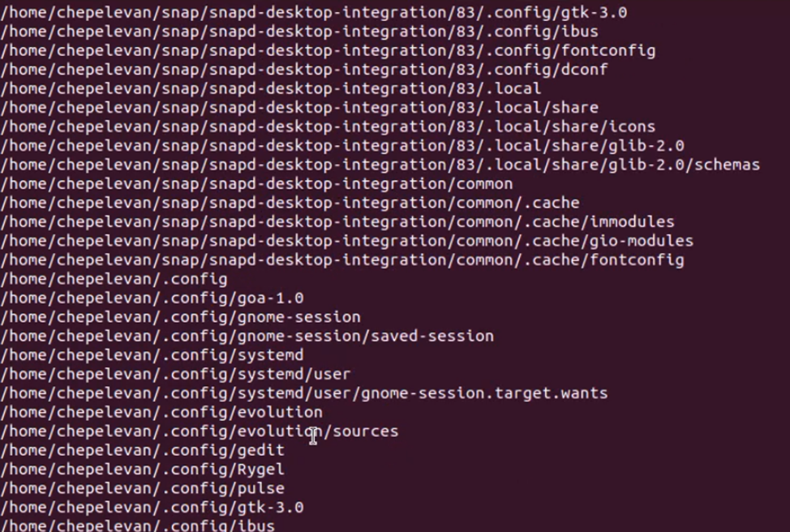

# Отчет по лабораторной работе **№6**

Дисциплина: Операционные системы

Студент: Чепелев Алексей Николаевич

Группа: НПМбв-02-20

Москва 2024 г.


# Цель работы
Ознакомление с инструментами поиска файлов и фильтрации текстовых данных. Приобретение практических навыков: по управлению процессами (и заданиями), по проверке использования диска и обслуживанию файловых систем.

# Выполнение лабораторной работы
1. Записываю в файл ```file.txt``` названия файлов, содержащихся в каталоге ```/etc```


2. Вывожу имена всех файлов из ```file.txt```, имеющих расширение ```.conf```, после чего записываю их в новый текстовой файл ```conf.txt```.


3. Определяю, какие файлы в моем домашнем каталоге имеют имена, начинавшиеся с символа c


4. Вывожу на экран (по странично) имена файлов из каталога ```/etc```, начинающиеся с символа ```h```.


5. Запускаю в фоновом режиме процесс, который будет записывать в файл ```~/logfile``` файлы, имена которых начинаются с ```log```.



6. Удаляю файл ```~/logfile```


7. Запускаю из консоли в фоновом режиме редактор ```gedit```


8. Справка ```man kill```, чтобы завершить процесс ```gedit```


9. Выполняю команды ```df``` и ```du```, предварительно получив более подробную информацию об этих командах, с помощью команды ```man```.


10. Вывожу имена всех директорий, имеющихся в моем домашнем каталоге.



# Вывод
Ознакомился с инструментами поиска файлов и фильтрации текстовых данных. Приобрел практические навыки по управлению процессами, по проверке использования диска и обслуживанию файловых систем.


# Ответы на вопросы:
1. stdin, stdout, stderr
2. ">" перезапишет содержимое файла при каждой операции, в то время как ">>" дополнит файл новым содержимым, не удаляя старое.
3. Конвейер - это механизм, который позволяет объединять вывод одной команды с вводом другой команды без необходимости сохранять промежуточные результаты в файлы.
4. Программа - это статическая сущность, которая хранится на диске, в то время как процесс - это динамическая сущность, которая активно выполняется в операционной системе.
5. PID - идентификатор процесса; GID - идентификатор группы
6. Задачи - это процессы, запущенные для выполнения определенной работы. Ps, kill, top.
7. top позволяет отображать список процессов, работающих в системе. Htop предоставляет более удобный интерфейс для отображения процессов и управления ими.
8. find используется для поиска файлов и каталогов в файловой системе.
9. grep позволяет искать текстовые данные в файлах
10. df
11. du -sh ~
12. kill название_процесса
