# Отчет по лабораторной работе **№7**

Дисциплина: Операционные системы

Студент: Чепелев Алексей Николаевич

Группа: НПМбв-02-20

Москва 2024 г.

# Цель работы
Освоение основных возможностей командной оболочки Midnight Commander. Приобретение навыков практической работы по просмотру каталогов и файлов; манипуляций с ними.

# Выполнение лабораторной работы
1. Изучаю информацию при помощи команды ```man mc```
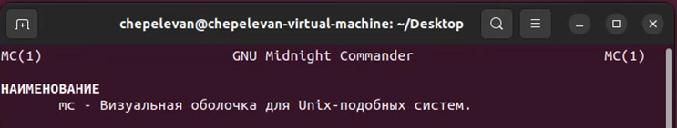

2. Запускаю ```MC``` через командную строку
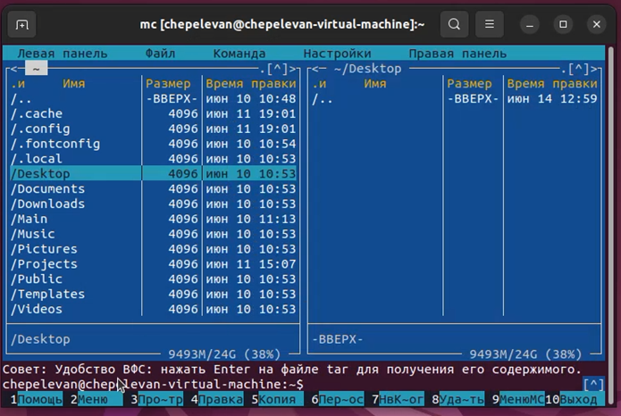

3. Выполняю несколько операций ```MC```, используя панель управления
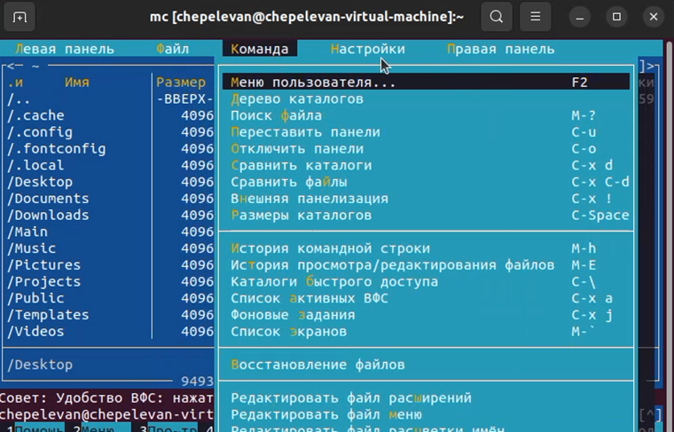

4. Просматриваю содержимое текстового файла
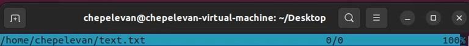

5. Редактирую этот файл
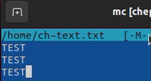

6. Создаю каталог при помощи оболочки ```MC```
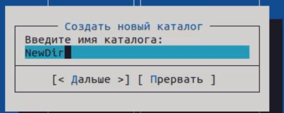

7. При помощи оболочки ```MC``` ищу файл с расширением ```.cpp``` и строкой ```main```
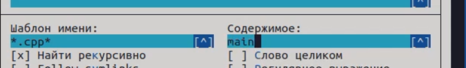
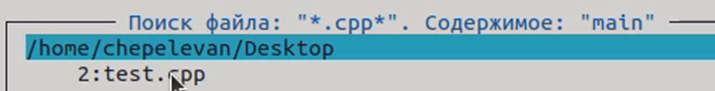

8. Создаю текстовый файл ```text.txt``` и вставляю в него небольшой фрагмент текста
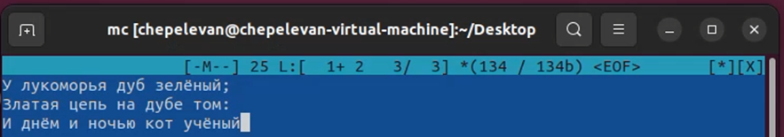

9. Проделываю операции по редактированию текста (копирование фрагмента на новую строку, перенос на новую строку, сохранение файла) при помощи сочетания клавиш:
```Ctrl-y``` – удаление строк
```Ctrl-u``` – отмена последнего действия
```Ins``` – вставка скопированного элемента
```PG UP``` – переход в начало текста
```PG DOWN``` – переход в конец текста

10. Открываю файл с расширением ```.CPP```
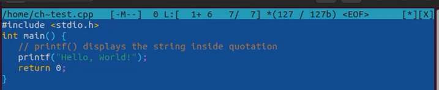

11. Используя сочетание клавиш ```ctrl + S``` включаю и выключаю подсветку синтаксиса 
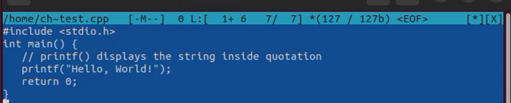

# Вывод
В этой лабораторной работе я освоил возможности командной оболочки ```midnight commander```. Приобрел навыки по работе с ней.

# Ответы на вопросы:
1. Командный режим; Режим файлового менеджера; Режим просмотра; Режим редактора.
2. Создание файлов и директорий (```mkdir```); Копирование файлов и директорий (```cp```); Перемещение файлов и директорий (```mv```); Удаление файлов и директорий (```rm```); Просмотр содержимого файла (```cat```); Поиск файлов (```find```, ```grep```).
3. Открыть (```F3```); Изменить права доступа (```F9, p```); Создать связь (```Ctrl + x```, ```s```); Создать каталог (```F7```); Копировать (```F5```); Вырезать (```F6```); Вставить (```F5/F6```); Удалить (```F8```); Искать файлы (```Alt+?```); Контрастные цвета (```F10, c```); Изменить панель (```Alt + o```); Выход (```Alt + q```).
4. Открыть файл; Просмотреть; Редактировать; Копировать; Переместить; Создать каталог; Изменить права доступа; Удалить.
5. Просмотреть; Конфигурация; Интерфейс; Поведение; Расширения; Цвета; Директории; Панели; Выход.
6. ```cd``` - Сменить текущий каталог;
```cp``` - Копирование файлов и каталогов;
```rm``` - Удалить файлы или каталоги;
```mkdir``` - Создать новый каталог;
```view``` - Просмотр файлов;
```edit``` - Редактировать файлы;
```find``` - Поиск файлов в каталоге;
```chmod``` - Изменить права доступа к файлу или каталогу.
7. Дайте характеристику средствам ```mc```, которые позволяют создавать меню, определяемые пользователем: 
это позволяет пользователям настраивать собственные команды и скрипты для выполнения определенных действий в файловом менеджере.
8. Дайте характеристику средствам ```mc```, которые позволяют выполнять действия, определяемые пользователем, над текущим файлом: 
В ```MC``` есть возможность создавать пользовательские команды и скрипты и команды, которые будут работать с выбранным файлом.


