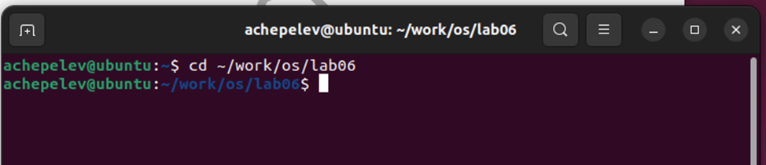
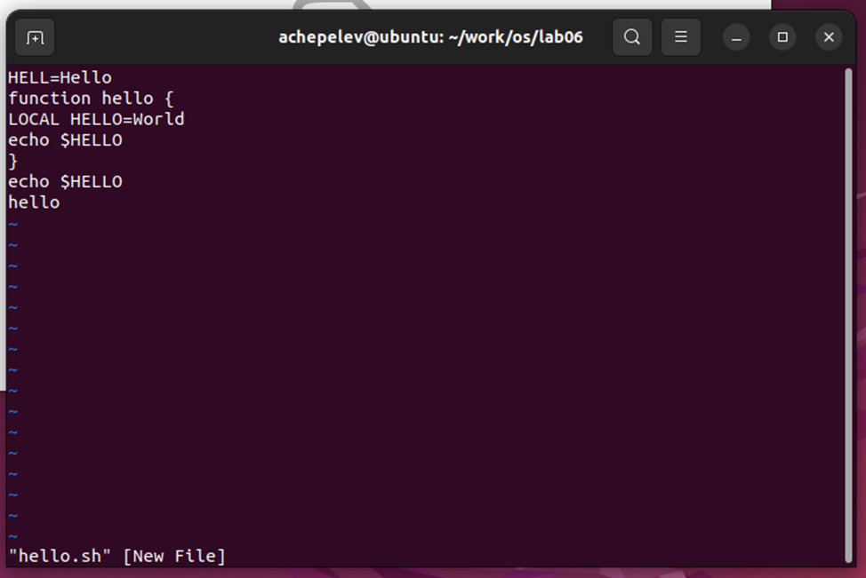
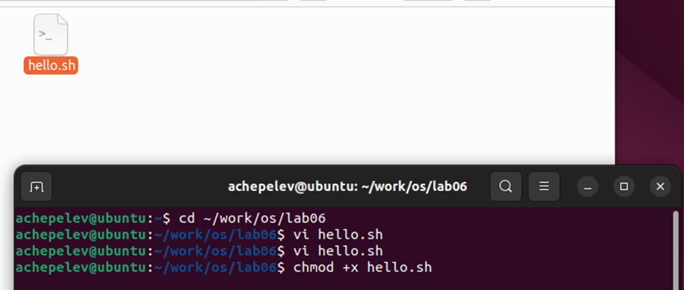
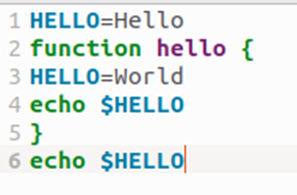

### Отчет по лабораторной работе **№8**

Дисциплина: Операционные системы

Студент: Чепелев Алексей Николаевич

Группа: НПМбв-02-20

Москва 2024 г.

## Формулировка цели работы:

Познакомиться с операционной системой Linux. Получить практические
навыки работы с редактором vi, установленным по умолчанию практически во
всех дистрибутивах.

**Описание результатов выполнения задания:**

Созданаие каталога с именем \~/work/os/lab06 и переход в него:



Вызываю vi на редактирование файла 1 ```vi \~/work/os/lab06/hello.sh```

Нажал клавишу i и ввожу следующий текст:



Нажал w (записать) и q (выйти), а затем нажал клавишу Enter для
сохранения вашего текста и завершения работы. 8. Сделайте файл
исполняемым



Вызвал vi на редактирование файла


Дальше я провожу изменения файла через vi


Результат измененного файла.

## Вывод:

В этой лабораторной работе я научился создавать файлы и также их
изменять при помощи текстового редактора **vi**.

## Ответы на контрольные вопросы:

1\. Режимы работы редактора Vi включают командный режим, визуальный
режим, режим вставки и нормальный режим.

2\. Чтобы выйти из редактора без сохранения изменений, используем
команду :q!.

3.Команды позиционирования включают перемещение курсора, копирование и
вставку текста, а также поиск и замену текста.

4\. Слово в редакторе Vi --- это последовательность символов,
ограниченная пробелами или символами конца строки.

5\. Для перехода в начало или конец файла используем команды :first и
:last.

6.Основные группы команд редактирования включают перемещение курсора,
копирование и вставку текста, поиск и замену текста, а также работу со
строками и буферами.

7\. Чтобы заполнить строку символами \$, используем команду :set
fillcolumn=10.

8\. Чтобы отменить некорректное действие, используем команду :undo.

9\. Основные группы команд режима последней строки включают перемещение
курсора, копирование и вставку текста, поиск и замену текста, а также
работу со строками и буферами.

10\. Чтобы определить позицию, в которой заканчивается строка,
используем команду :set list.

11\. Опции редактора Vi можно узнать, используя команду :help.

12\. Чтобы определить режим работы редактора Vi, используем команду
:mode.

13\. Граф взаимосвязи режимов работы редактора Vi включает основной
режим, командный режим, визуальный режим, режим вставки и нормальный
режим.
