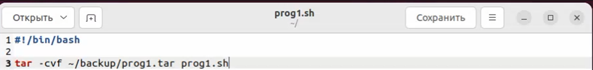
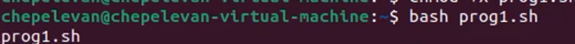
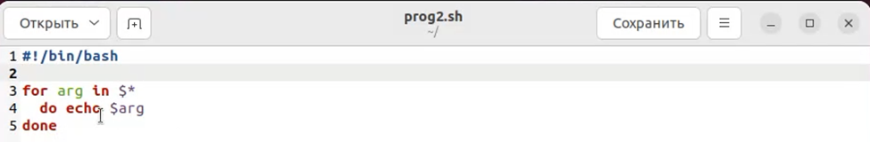
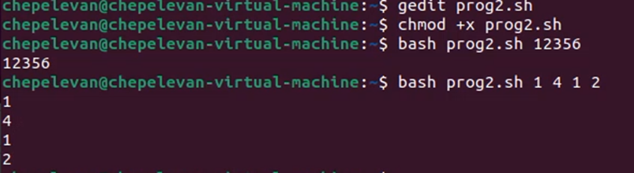
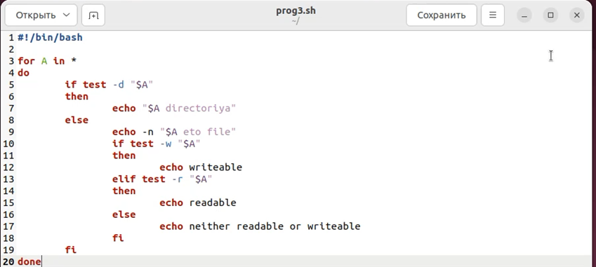
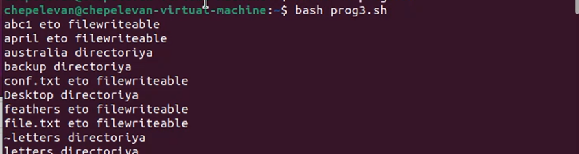
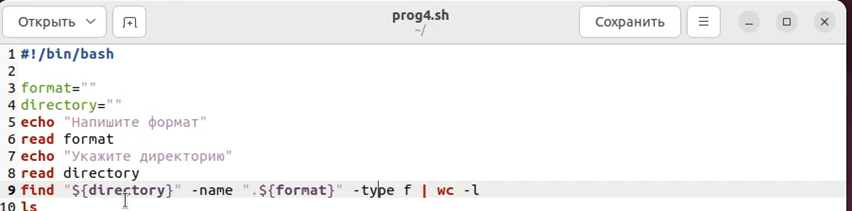
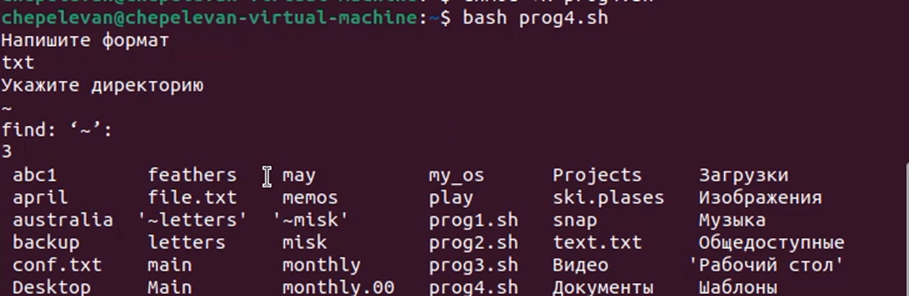

# Отчет по лабораторной работе **№9**

Дисциплина: Операционные системы

Студент: Чепелев Алексей Николаевич

Группа: НПМбв-02-20

Москва 2024 г.

# Цель работы
Изучить основы программирования в оболочке ОС UNIX/Linux. Научиться писать небольшие командные файлы.

# Выполнение лабораторной работы
1. Написал скрипт, который при запуске будет делать резервную копию самого себя в другую директорию ```backup``` в домашнем каталоге.


2. Добавляю права на выполнение ```prog1.sh```


3. Запускаю скрипт


4. Проверяю его на выполнение. Скрипт отработал и создал архив ```tar``` в папке ```backup```


5. Написать пример командного файла, обрабатывающего любое произвольное число аргументов командной строки.


6. Добавляю права на выполнение ```prog2.sh```


7. Запускаю скрипт


8. Написать командный файл — аналог команды ```ls```


9. Добавляю права на выполнение ```prog3.sh```


10. Запускаю скрипт


11. Написать командный файл, который получает в качестве аргумента командной строки формат файла и вычисляет количество таких файлов в указанной директории.


12. Добавляю права на выполнение ```prog4.sh```


13. Запускаю скрипт


# Вывод
В этой лабораторной работе я изучил основы программирования в оболочке ```ОС UNIX/Linux```. Научился писать небольшие командные файлы.

# Ответы на вопросы:
1. Командная оболочка – это интерфейс между пользователем и операционной системой, который позволяет пользователю взаимодействовать с операционной системой путем ввода текстовых команд. Примеры командных оболочек включают ```Bash (Bourne Again Shell), Zsh (Z Shell), Fish (Friendly Interactive Shell)``` и другие. Они отличаются по своим возможностям, синтаксису, встроенным функциям и поддерживаемым расширениям.
2. ```POSIX``` (Portable Operating System Interface) – это семейство стандартов, разработанных для обеспечения совместимости между различными операционными системами Unix. Он определяет общие интерфейсы для программирования на языке C, командной строки и управления файлами.
3. В языке программирования ```bash``` переменные определяются путем присваивания значений их именам. Например:
Переменные: ```variable_name=value```
Массивы: ```array_name[index]=value```
4. Оператор ```let``` используется для выполнения арифметических выражений в ```bash```. Оператор ```read``` используется для считывания значений из стандартного ввода и присваивания их переменным.
5. В языке программирования ```bash``` можно применять стандартные арифметические операции, такие как сложение, вычитание, умножение и деление.
6. Операция ```(( ))``` в ```bash``` используется для выполнения арифметических вычислений.
7. Некоторые стандартные имена переменных в ```bash```:
```HOME```: домашний каталог текущего пользователя.
```PWD```: текущий рабочий каталог.
```PATH```: список каталогов, в которых операционная система ищет исполняемые файлы.
```USER```: имя текущего пользователя.
8. Метасимволы – это символы, которые имеют специальное значение в контексте командной строки или шаблонов файлов. Некоторые примеры метасимволов включают ```*, ?, [ ], { }, |, ; и &```.
9. Для экранирования метасимволов в ```bash``` используется обратная косая черта ```\```. Например, чтобы использовать символ ```*``` как обычный символ, его можно экранировать так: ```\*```.
10. Для создания и запуска командных файлов в ```bash``` можно использовать текстовый редактор для создания файла с расширением ```.sh```, затем присвоить ему права на выполнение с помощью команды ```chmod +x filename.sh```, и, наконец, запустить файл с помощью команды ```./filename.sh```.
11. Функции в языке программирования ```bash``` определяются с использованием ключевого слова ```function``` или просто с именем функции, после чего идет блок кода. Например:

function my_function {
    # Код функции
    }

12. Для определения, является ли файл каталогом или обычным файлом, можно использовать команду ```test```. Например:
Проверка на обычный файл: ```test -f filename```
Проверка на каталог: ```test -d filename```
13. Команды ```set```, ```typeset``` и ```unset``` используются для работы с переменными в ```bash```:
```set```: устанавливает значения и флаги для параметров командной строки.
```typeset```: используется для объявления переменных с определенными свойствами, такими как readonly или ```integer```.
```unset```: удаляет значения переменных.
14. Параметры передаются в командные файлы в виде аргументов командной строки. Они доступны внутри скрипта через специальные переменные ```$1, $2, $3``` и так далее, где ```$1``` содержит первый аргумент, ```$2``` – второй и т.д.
15.  Некоторые специальные переменные языка ```bash``` и их назначение:
```$0```: имя текущей выполняемой программы.
```$#```: количество аргументов, переданных скрипту.
```$?```: код возврата последней выполненной команды.
```$$```: PID (идентификатор процесса) текущего скрипта.
```$!```: PID последнего запущенного фонового процесса.


