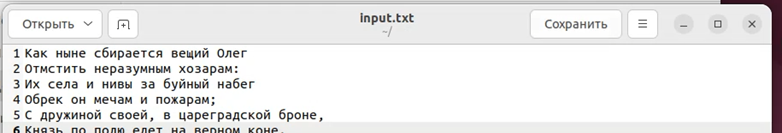
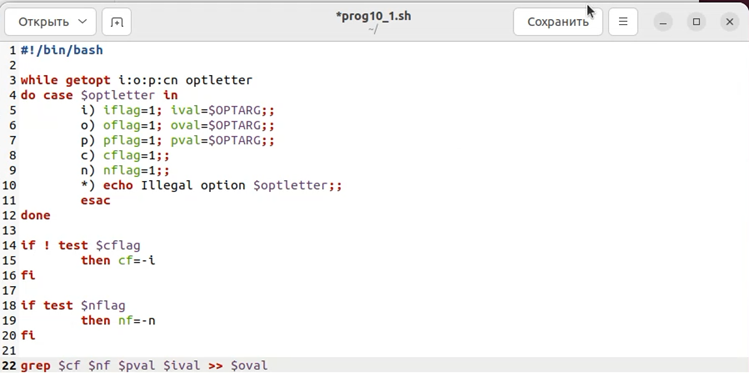
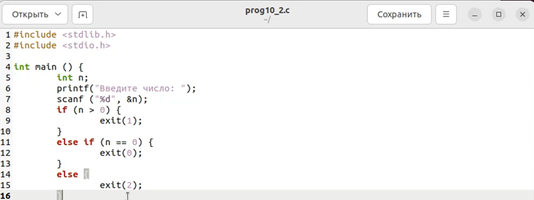
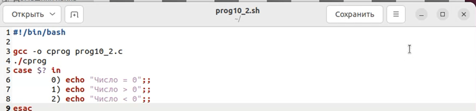
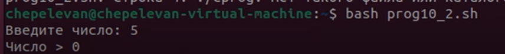
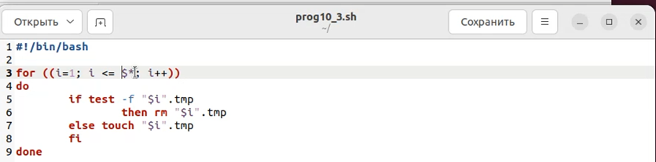
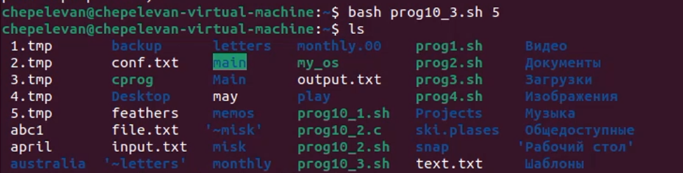
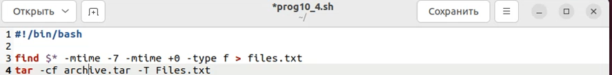
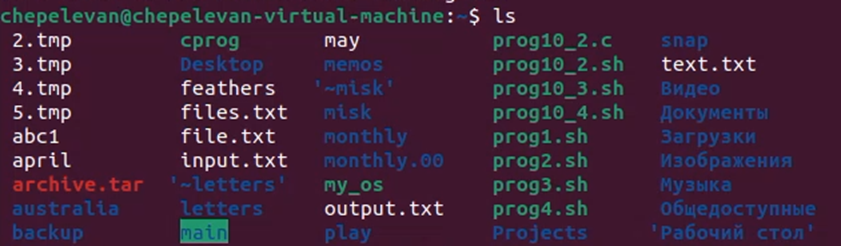

# Отчет по лабораторной работе **№10**

Дисциплина: Операционные системы

Студент: Чепелев Алексей Николаевич

Группа: НПМбв-02-20

Москва 2024 г.

# Цель работы

Изучить основы программирования в оболочке ```ОС UNIX```. Научится писать более сложные командные файлы с использованием логических управляющих конструкций и циклов.

# Выполнение лабораторной работы

1. Используя команды ```getopts grep```, написать командный файл, который анализирует командную строку.

2. Создаю входящий файл с текстом 


3. Заполняю его


4. Создаю командный файл


5. Выдаю ему права


6. Выполняю его


7. Результат:


8. Написать на языке Си программу, которая вводит число и определяет, является ли оно больше нуля, меньше нуля или равно нулю.



9. Выполняю скрипт


10. Написать командный файл, создающий указанное число файлов, пронумерованных последовательно от 1 до N.


11. Выдаю ему права


12. Выполняю его


13. Написать командный файл, который с помощью команды tar запаковывает в архив все файлы в указанной директории.


14. Выполняю его



# Вывод

В этой лабораторной работе я изучил основы программирования в оболочке ОС UNIX.

# Ответы на вопросы:

1. ```getopts``` используется для обработки аргументов командной строки. Она позволяет извлекать опции и их значения из списка аргументов.
2. Метасимволы используются в генерации имён файлов для сопоставления шаблонов. Например, звездочка (```*```) сопоставляет любое количество символов, а знак вопроса (```?```) сопоставляет любой один символ.
3. Операторы управления действиями используются для изменения потока выполнения скрипта
4. ```continue```: Переходит к следующей итерации цикла, пропуская оставшиеся операторы в текущей итерации; ```break```: Немедленно выходит из цикла.
5. Команды ```false``` и ```true``` используются для возврата кода выхода, указывающего на успех (```true```) или неудачу (```false```).
6. Эта строка проверяет, существует ли файл с именем ```man$s/$i.$s```. Если файл существует, выполняется оператор ```then```.
7. ```while```: Выполняет код, пока условие истинно; ```until```: Выполняет код, пока условие ложно.
